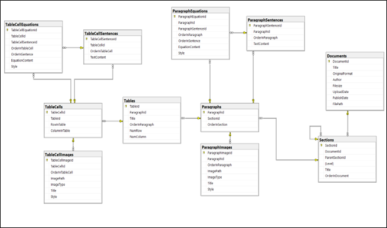
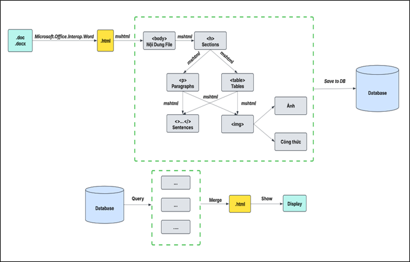
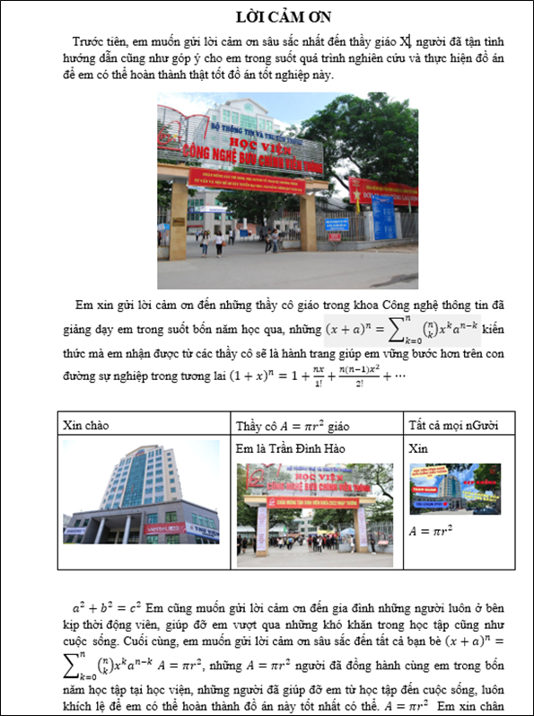
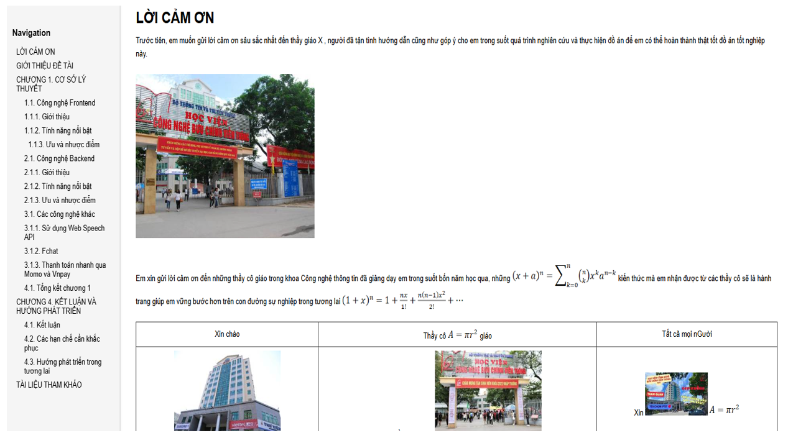
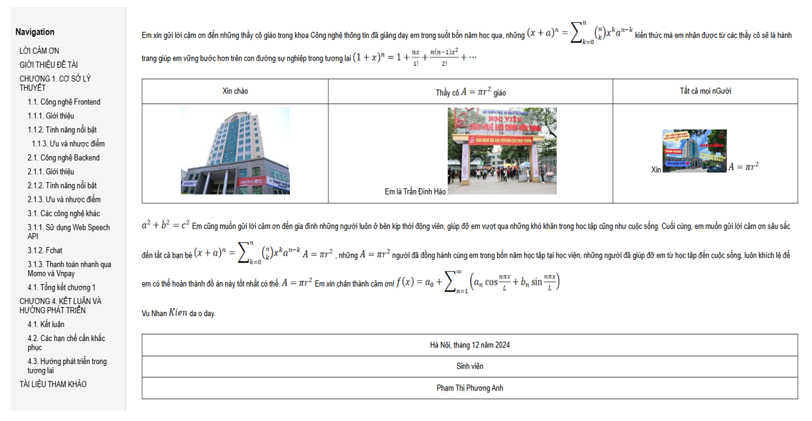

# 🗂️ Chuyển đổi tập tin DOC, DOCX lưu trữ trong CSDL SQL Server

📌 Đề tài thực tập cơ sở: **Xây dựng phần mềm chuyển đổi tập tin DOC, DOCX lưu trữ trong CSDL SQL Server**  
🏫 Học viện Công nghệ Bưu chính Viễn thông - PTIT  
👨‍🎓 Nhóm thực hiện: Trần Đình Hào, Vũ Nhân Kiên, Lê Khánh Toàn, Lưu Xuân Bắc, Phạm Quang Dương  
👨‍🏫 Giảng viên hướng dẫn: ThS. Nguyễn Xuân Anh  
📄 **Báo cáo PDF**: [PDF](https://drive.google.com/file/d/1KT2dz6ifLvTI-0aIBjRxQK4Pc8JtJPVt/view?usp=sharing)  
👉 *Cho tôi 1 ⭐ nếu nó hữu ích với bạn nhé, nhóm làm đề tài này tâm huyết lắm 😅*

---

## 📝 Mô tả đề tài

Xây dựng một phần mềm có khả năng:
- Chuyển đổi các file `.doc`, `.docx` sang định dạng HTML
- Phân tích nội dung HTML → Trích xuất cấu trúc tài liệu
- Lưu trữ từng phần tử vào cơ sở dữ liệu SQL Server (gồm đoạn văn, bảng biểu, ảnh, công thức…)
- Tái cấu trúc và hiển thị tài liệu từ CSDL về lại dạng HTML gốc

---

## 🧱 Kiến trúc hệ thống

### 🛠 Công nghệ sử dụng:
- C# .NET (Windows Forms App)
- Thư viện: `Microsoft.Office.Interop.Word`, `mshtml`
- Cơ sở dữ liệu: SQL Server 2012
- IDE: Visual Studio 2012

### 🗃️ Cấu trúc CSDL chính gồm các bảng:
- `Documents`, `Sections`, `Paragraphs`
- `ParagraphSentences`, `ParagraphImages`, `ParagraphEquations`
- `Tables`, `TableCells`
- `TableCellSentences`, `TableCellImages`, `TableCellEquations`

Sơ đồ mô hình CSDL: phân cấp từ tài liệu → section → đoạn văn → câu/ảnh/công thức → bảng → ô → nội dung trong ô.

  

---

## ⚙️ Chức năng chính

1. **Chuyển đổi Word → HTML**
   - Sử dụng `Microsoft.Office.Interop.Word` để chuyển file `.doc/.docx` sang `.html`

2. **Phân tích HTML và trích xuất nội dung**
   - Dùng `mshtml` để truy xuất các phần tử như `h1/h2`, `p`, `img`, `table`, `math`...

3. **Lưu vào SQL Server**
   - Mỗi thành phần được ánh xạ vào bảng tương ứng

4. **Tái cấu trúc và hiển thị tài liệu**
   - Truy vấn dữ liệu từ DB, tái tạo HTML, hiển thị tài liệu qua trình duyệt tích hợp

### Flow:

  

---

## 💡 Kết quả đạt được

- ✅ Giao diện đơn giản, dễ sử dụng
- ✅ Chuyển đổi thành công tài liệu có nội dung phức tạp
- ✅ Tái tạo tài liệu gần giống bản gốc (gồm ảnh, bảng, tiêu đề, công thức…)
- ✅ Lưu trữ dữ liệu có cấu trúc rõ ràng, dễ mở rộng

### Before:

  

### After:

  

  

